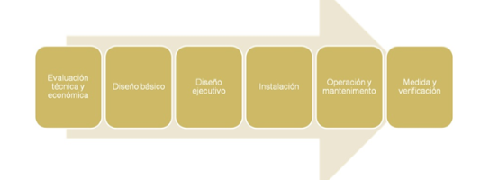
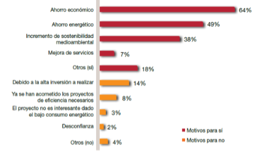

# Contenido de una propuesta de mejora
## Capítulo 5 - Optimización eficiencia energética (I): Contenido de una propuesta de mejora

Tal como vimos en el capítulo 1 uno de los objetivos finales de un auditoria energética son la propuesta de medidas de mejora de la eficiencia energética, a partir de ahora MAES. Es una de las partes mas importantes de la auditoría ya que el objetivo de la misma es reducir el coste energético del edificio auditado. Debido a lo extenso del apartado de *Optimización de la eficiencia energética* se ha dividido en dos capítulos:

- Capítulo 5: Etapas, contenido  y estudio de viabilidad de una propuesta de mejora de ahorro energético.

- Capítulo 6: Medidas para la optimización de la eficiencia energética.

## Objetivos Capítulo 5
- Conocer las etapas para la implantación de una MAES.
- Saber los beneficios que se pueden obtener.
- Detectar los problemas para realizarla.
- Enumerar los apartados que ha de contener una MAES.
- Aprender a calcular la inversión de una MAES.
- Realizar descripciones técnicas de una MAES.
- Conocer parámetros para evaluar la rentabilidad económica de una MAES.
- Toma de decisiones para la elección de MAES.

A partir de estos conocimientos, en el capítulo 6 se presentarán las mejoras de ahorro energético (MAES). Se ha planteado ese capítulo como un conjunto de ejemplos reales de cada tipo de optimización para que veáis con datos reales la aplicación de cada caso.

## 5.1 Etapas de una Medida de Ahorro Energético

Las etapas de una medida de ahorro energético (MAES) desde su concepción hasta su uso son las siguientes: 

s
Fig. 01 Etapas de una MAES 

- *Evaluación técnica y económica*: Es la parte que contendrá la auditoria energética
- *Diseño básico y ejecutivo*: Realización del proyecto para la ejecución de las MAEs.
- *Instalación*: Ejecución de las MAEs.
- *Operación y mantenimiento*: Puesta en marcha y uso.
- *Medida y verificación*: Comprobación de los ahorros energéticos reales obtenidos.

 

El principal motivo para la no implantacion de las MAES suele ser la inversión a realizar. Muchas empresas no pueden llevar a cabo las MAEs, aunque tengan un ahorro que conlleve una recuperación de la inversión en muy poco tiempo, porque no pueden realizar la inversión inicial. 

Fig. 02 Motivos para realizar una MAES en el sector hotelero (Fuente: PWC)

 

En un estudio de la consultora PWC sobre la eficiencia energética en el sector hotelero español se comprobó que solo un 39% de las inversiones en MAEs se realizaron con capital propio del hotel. Vemos en la gráfica diferentes fuentes de procedencia de la inversión entre ellas las *ESE*, una tipología de empresa que se va extendiendo en el sector terciario.

 

 

Fig. 03 Origen de la inversión de una MAES (Fuente: PWC)

 

### Empresas de servicios energéticos (ESE)

Una ESE es, según la directiva europea 2012/27 una persona física o jurídica que proporciona servicios energéticos o de mejora de la eficiencia energética en las instalaciones o locales de un usuario y afronta cierto grado de riesgo económico al hacerlo. ***El pago de los\*** ***servicios prestados se basará (en parte o totalmente) en la obtención de mejoras de la eficiencia energética\*** y en el cumplimiento de los demás requisitos de rendimiento convenidos.

La ESE consigue un proyecto a cambio de ir cobrando sus costes a medida que se vayan generando ahorros económicos derivados de las actuaciones que ella a financiado. La propietaria del edificio consigue realizar las inversiones sin ningún coste renunciando a parte de los ahorros económicos conseguidos de estas. Hay multitud de tipologías de contratos de empresas de servicios energéticos siendo estos muy complejos. 

- *Para saber más sobre ESES:*

http://www.eoi.es/ese/que-es-ese/default.asp

- *Modelo Contrato ESE de IDAE:*

http://www.idae.es/uploads/documentos/documentos_10704_Propuesta_modelo_contrato_serv_energ_07_32458412.pdf

 

 

 

### Protocolo medida y verificación

Unza vez se ha implantado la medidas es necesario conocer el resultado de las mismas, para eso es necesario un plan de medida y verificación del ahorro. Existen varios protocolos para la realización de estos planes, entre ellos uno de las más conocidos internacionalmente el IPMVP de EVO.

En estos protocolos se parte del consumo antes de la mejora y después de la mejora. El ahorro obtenido por la mejora no es directamente la diferencia entre estos dos consumos ya que las condiciones energéticas pueden haber variado de un período de tiempo a otro (climatología, producción, horas de apertura,…).

Por eso el consumo antes de la mejora se actualiza a como habría sido el consumo si no se habría aplicado la mejora (por ejemplo este año ha hecho mas frío y por lo tanto el consumo sera superior) con las condiciones reales que han sucedido . Ahora el ahorro si es la diferencia entre el consumo con la mejora y el consumo anterior a la mejora actualizado.

 

Fig.04 Protocolo IPMVP (Fuente EVO)

## 5.2 Contenido de una propuesta de mejora.

Una propuesta de MAES tiene que contener los siguientes conceptos:

 

- **Descripción técnica**: Explicación de la mejora y calculo de la inversión

- **Evaluación energética**: Determinación y explicación del ahorro energético

- **Evaluación financiera**: Análisis de la viabilidad económica.

### 5.2.1 Descripción técnica

La descripción técnica permitirá al usuario final comprender las bases de funcionamiento del sistema y las energías requeridas así como los motivos de la mejora de la eficiencia energética y su consecuente ahorro.  Se incluirán las características técnicas de los principales equipos desde el punto de vista energético. 

En función de la MAES está descripción técnica será sencilla o detallada. No es lo mismo describir una un cambio de una caldera que un cambio de toda la climatización. La definición del nivel de detalle será a criterio del técnico.

 

#### Ejemplo de descripción técnica de una MAES: Energia solar para un Hotel

Actualmente en el edificio no existe ningún aprovechamiento de energías renovables y la producción de ACS se realiza con la caldera de gas natural. Las placas solares térmicas aprovechan la energía gratuita del sol para precalentar el agua que utilizaremos para la ACS. 

 

 

Fig.05 Placa solar térmica

 

 

La energía que no llegue de las placas solares se hará con el apoyo de la caldera existente. Para dimensionar las placas solares usaremos una demanda de 55 litros / día por persona y la ocupación real de cada mes.

Se propone una instalación de 114 captadores con una superficie de captación de 253m ² que cubrirían el 50% del consumo energético. Las placas se colocarían en la cubierta indica en la siguiente figura, con la misma inclinación (35º) y orientación (-25 º SE) de esta.

 

 

 

Fig.06 Emplazamiento propuesto

 

Con la integración de las placas solares a la instalación actual (caldera + dos depósitos de ACS) la producción de ACS quedaría de la siguiente manera:

 

Fig.07 Esquema principio

 

Los datos técnicos de la placa propuesta son los siguientes:

- *Modelo: SV2*
- *Superficie bruta colector: 2,49 m2*
- *Superficie de absorción: 2,31 m2*
- *Anchura x altura: 1056x2380 mm*
- *Profundidad: 90 mm*
- *Peso(vacío): 52 kg*
- *Volumen de fluido: 1,83 l*
- *Rendimiento óptico: 81,6 %*
- *Coef. pérdida calor\* a1(W/qmK): 3,359*
- *Coef. pérdida calor\* a2(W/qmK^2): 0,026*
- *Presión serv. admisible: 6 bar*
- *Temperatura inactividad max.: 221 ºC*
- ** referente al área de absorción.*

Una vez descrita técnicamente la MAES tendremos que valorarla económicamente. No se trata de realizar un presupuesto de proyecto ejecutivo sino tener un valor para que el propietario del edificio tenga una idea del coste de la inversión y realizar el estudio de viabilidad económica.

La inversión contendrá el coste del equipo-mejora propuesta, la mano de obra de instalar los equipos y los costes auxiliares (material auxiliar, transporte, puesta en marcha). La inversión la podemos conseguir de diferentes maneras:

 

- *Anterior proyectos o auditorías realizadas.*

Es interesante a partir de ir realizando MAES en auditorías o proyectos, recopilar la información y crear una propia base de datos de precios.

 

- *Petición de un presupuesto a un industrial o comercial.*

Si tenemos la posibilidad de que un industrial nos valore el coste tendremos directament el precio de la MAEs. En la auditoría solo pondremos el coste total de la inversión y adjuntaremos su presupuesto en un anexo. Si el presupuesto lo obtenemos directamente de la casa comercial del equipo tendremos que añadir la mano de obra y elementos auxiliares.

 

Fig 08. Presupuesto de casa comercial (Fuente: Airlan)

 

- *Catálogos-tarifas comerciales.*

Existen catálogos donde salen los PVP de los equipos. A estos costes tendremos que incluir la mano de obra de instalar los equipos y los costes auxiliares (material auxiliar, transporte, puesta en marcha). La mayoría de industriales tienen descuentos sobre los PVP por lo que muchas veces sus presupuestos pueden tener precios inferiores a nuestros cálculos a partir de las tarifas.

 

 

Fig 09. Tarifa caldera baja temperatura (Fuente: Baxi Roca)

 

 

- *Base de datos públicos.*

 Existen bases de precios donde podemos encontrar los costes de nuestra inversión.  

#### Bases de datos de precios - ITEC

El “Institut de Tecnologia de la Construcció de Catalunya” tiene colgadas en su web una base de datos con precios genéricos y con precios de empresas que han incluido sus tarifas en la base.

[**http://itec.cat/noubedec.e/bedec.aspx**](http://itec.cat/noubedec.e/bedec.aspx)

Si queremos buscar una caldera de condensación de 85kW para calefacción y ACS podemos usar el buscador o ir buscando el capítulo correspondiente en el árbol de la izquierda

 

​        E – Elementos unitarios de edificación

​        EE – Instalaciones de climatización, calefacción y ventilación mecánica.

​        EE2 – Calderas.

​        EE22 – Calderas de gas atmosféricas estancas y de condensación.

​        EE22_06 – Caldera de gas de consensación, colocada

 

Ahora se nos abre un menú paramétrico donde podremos escoger las características que deseemos. En el menú “Listar” (arriba izquiera de la figura siguiente) nos dice cuantas calderas de la base de datos nos cumple los requisitos que vamos introduciendo.

 

Fig.10 Menú paramétrico (Fuente: ITEC)

 

 

 

Fig. 11 Partida de la caldera que cumple los requisitos (Fuente: ITEC)

 

 

Fig. 12 Partida descompuesta de la caldera (Fuente: ITEC)

 

#### Ejercicio: Cálculo de la inversión (I)

De una propuesta de MAES nos faltan completar algunas de las partidas. ¿Cuál sería la inversión para el circuito primario de un sistema de placas solares?

*Nota: usar la base de datos de ITEC.* 

| Partida                                               | Precio  |
| ----------------------------------------------------- | ------- |
| 26 m² de superficie. de placas solares térmicas.      | ???     |
| 1 x Bomba circulación UPS 25-60                       | 550 €   |
| 1 x aerotermo de 32 kW                                | ???     |
| 90 metros de Tuberías de Cobre de 20/22 + aislamiento | ???     |
| 20 metros de Tuberías de Cobre de 40/42 + aislamiento | 617 €   |
| Interacumulador de 2000 litros                        | ???     |
| Valvulería y otros                                    | 8.000 € |

 

Fig. 13 Esquema simplificado Energía solar térmica 

***Solución***

*Nota: Podéis obtener diferentes precios en función de las características técnicas de cada partida. Eso no quiere decir que solo sea correcto mi presupuesto sino que tenemos muchas variantes.*

 

 

Fig. 14 Partidas energia solar térmica (Fuente: ITEC) 

 

| Partida                                               | Unidades | €/unidad   | Precio   |
| ----------------------------------------------------- | -------- | ---------- | -------- |
| 26 m² de superficie. de placas solares térmicas.      | 13       | 497,92 €   | 6.473 €  |
| 1 x Bomba circulación UPS 25-60                       |          |            | 550 €    |
| 1 x aerotermo de 32 kW                                | 1        | 791,02 €   | 791 €    |
| 90 metros de Tuberías de Cobre de 20/22 + aislamiento | 90       | 27,27 €    | 2.454 €  |
| 20 metros de Tuberías de Cobre de 40/42 + aislamiento |          |            | 617 €    |
| Interacumulador de 2000 litros                        | 1        | 4.476,00 € | 4.476 €  |
| Valvulería y otros                                    |          |            | 8.000 €  |
|                                                       |          | Total      | 23.361 € |

 

Ya tenemos un precio aproximado de €/m² para instalaciones alrededor de 26m² de placas solares térmicas. La próxima vez que tengamos una MAES de este tipo recuperaremos este precio.

 

#### Bases de datos de precios – Generador de precios CYPE

Esta base de datos ha sido creada por CYPE Ingenieros y incluye productos de fabricantes y productos genéricos. A diferencia de otros bancos de precios, el generador de precios de la construcción de CYPE Ingenieros tiene en cuenta las características concretas de cada obra para generar precios específicos para el proyecto que se está presupuestando pudiendo variar los de la obra de referencia.                               

http://www.generadordeprecios.info/

 

La base de datos está dividida en rehabilitación y obra nueva e igual que en el caso anterior tenemos un árbol a la izquierda para buscar el precio de cada partida. Vamos a buscar qué precio tiene una luminaria *Downlight circular empotrada de fluorescente con balastro electrónico de 2x26W para rehabilitación*. Primero desde el árbol de rehabilitación navegaremos hasta encontrar la iluminación interior.

 

Fig. 15 Árbol de partides (Fuente: Generadordeprecios.info)

 

Una vez dentro del menú de *luminaria empotrada tipo downlight* iremos escogiendo las opciones que deseemos. Existen precios genéricos (icono amarillo) y precios de dos casas comerciales (Lledó y LAMP), escogeremos el modelo Aluminic de LAMP.

 

Fig. 16 Menú de datos técnicos (Fuente: Generadordeprecios.info)

 

Tenemos la opción de descargar al catálogo para usarlo en la descripción técnica y en la evaluación energética así como el presupuesto y el coste del mantenimento. 

Fig. 17 Datos técnicos luminaria (Fuente: LAMP)

 

Fig. 18 Presupuesto y coste de mantenimento (Fuente: Generadordeprecios.info)

 

#### Ejercicio: Cálculo de la inversión (II)

Buscad en la base de datos de CYPE la inversión necesaria para una bomba de calor para sistema VRV de Daikin de 85Kw de potencia térmica que tenga un EER alrededor de 3 con el opcional de recuperación de calor.

 

***Solución\***

***\***

Fig.19 Menú selección VRV Daikin (Fuente: generadordeprecios.info)

 

 Fig.20 Presupuesto VRV Daikin (Fuente: generadordeprecios.info)

 

### 5.2.2 Evaluación energética

Una vez conocida la inversión tenemos que explicar el ahorro energético previsto con la implantación de la mejora. En este apartado definiremos el consumo energético antes de la mejora y el consumo energético esperado después ella, explicando las causas del ahorro.

#### Ejemplo de evaluación energética de una MAES: Energia solar para un Hotel

La planta de placas solares térmicas para un hotel descritas en el apartado anterior producirían el 50% de la energía necesaria para ACS.

 

|            | Qa: Energia necesaria para ACSKwh | Energia aportada por el sistema solarkWh | Porcentaje cubierto por energía solar |
| ---------- | --------------------------------- | ---------------------------------------- | ------------------------------------- |
| Enero      | 19443                             | 8296                                     | 43%                                   |
| Febrero    | 27149                             | 11007                                    | 41%                                   |
| Marzo      | 23190                             | 15436                                    | 67%                                   |
| Abril      | 32623                             | 16881                                    | 52%                                   |
| Mayo       | 26664                             | 18825                                    | 71%                                   |
| Junio      | 33088                             | 19504                                    | 59%                                   |
| Julio      | 34239                             | 21680                                    | 63%                                   |
| Agosto     | 41996                             | 20060                                    | 48%                                   |
| Septiembre | 34845                             | 17643                                    | 51%                                   |
| Octubre    | 31623                             | 14816                                    | 47%                                   |
| Noviembre  | 22422                             | 9749                                     | 43%                                   |
| Diciembre  | 27240                             | 7727                                     | 28%                                   |
| Anual      | 354520                            | 181624                                   | 50%                                   |

 

 

 Actualmente esta energía se produce por una caldera de gas natural con un rendimiento del 85% según las mediciones efectuadas.

 

**Consumo = Demanda / Rendimiento**

 

Por lo tanto el consumo ahorrado seria de 181.624 kWh / 0,85 = 213.675 kWh que equivalen a 18.548m³ de gas natural.

 

### 5.2.3 Evaluación financiera

Para poder decidir si es interesante implantar una MAES es imprescindible realizar un análisis económico de la inversión. Este análisis será un estudio de viabilidad económica que podemos realizar de muchas maneras distintas en función del nivel de precisión y detalle que queramos**.**

Para analizar la viabilidad de las mejoras tendremos que utilizar parámetros económicos que vamos a explicar en este apartado.

 

**Período de retorno - Payback**

El período de retorno de la inversión permite establecer el tiempo en que se recuperará la inversión debido a los ahorros conseguidos por la mejora del sistema producida. 

**PR = Inversión / Ahorro económico anual (años)**

 Mejoras con un periodo de retorno inferior a 4-5 años son consideradas viables, para mejoras con un período superior la decisión estará en función de la vida útil del equipo propuesto y la inversión a realizar.

 

#### Ejemplo cálculo del PR de una MAEs

En el ejemplo de las placas solares necesitamos una inversión de 143.000€ para la implantación de los 114m². El ahorro energético calculado en el apartado anterior es de 213.675kWh que multiplicados por el coste del gas natural del edificio (0,06€/kwh) genera un ahorro económico anual de 12.820€. Vemos un período de retorno muy elevado a pesar de que la vida útil de las placas solares es de 20 años. 

PR = 143.000 /12.820 = 11,1 años

 

También puede ser interesante realizar un análisis de sensibilidad del PR en función de la posible variación del ahorro y de la inversión. Si el PR es muy sensible a estas variaciones puede que el parámetro no sea idóneo.

 

| Variación | Inversión | Ahorro   | PR   |
| --------- | --------- | -------- | ---- |
| -20%      | 114.400 € | 12.820 € | 8,9  |
|           | 143.000 € | 12.820 € | 11,2 |
| 20%       | 171.600 € | 12.820 € | 13,4 |
|           |           |          |      |
| Variación | Inversión | Ahorro   | PR   |
| -10%      | 143.000 € | 11.538 € | 12,4 |
|           | 143.000 € | 12.820 € | 11,2 |
| 10%       | 143.000 € | 14.102 € | 10,1 |

El inconveniente del método del PR es suponer los ahorros constantes al largo de todo el período si tener en cuenta que el valor del dinero varía con el tiempo y en la evolución del precio de la energía.

#### Valor del dinero

La fórmula para proyectar una cantidad de dinero hacia el futuro es la siguiente:

Vf = Va ( 1+ i)n

*Vf: Valor futuro*

*Va: Valor actual*

*i: interés unitario*

*n: número de años*

 

Inversamente la conversión de cantidades futuras al presente se llama actualización y se consigue de la siguiente fórmula:

Va = Vf /( 1+ i)n

 

*Ejemplo:*

*¿Q*ué valor tendrá 50.000€ al cabo de 5 años sometido a un tasa del 3%?

 

Vf = 50.000 (1+ 0.03)5= 57.963€

 

*¿Q*ué valor tendrán actualmente 50.000€ ahorrados dentro de 5 años si la tasa de actualización es del 3%?

 

Va = 50.000 /( 1+ 0.03)5= 43.130€

#### Ejercicio: Valor actual de los ahorros

Una MAEs provoca un ahorro de 3.100€ al año. Durante los 5 primeros años ahorraríamos 3.100€ lo que podría suponer unos ahorros acumulados de 15.500€. Vamos a comprobarlo con un tasa del 10%.

 

|       | Valor futuro | Valor actualizado |
| ----- | ------------ | ----------------- |
| Año 1 | 3.100 €      | 2.818 €           |
| Año 2 | 3.100 €      | 2.562 €           |
| Año 3 | 3.100 €      | 2.329 €           |
| Año 4 | 3.100 €      | 2.117 €           |
| Año 5 | 3.100 €      | 1.925 €           |
| Total | 15.500 €     | 11.751 €          |

 

 

Vemos como realmente los ahorros acumulados actualizados a día de hoy son de 11.751€, un 24% menos de los esperado. Si la MAES tenia una inversión de 12.250€ el periodo de retorno simple habría dado 3,9 años cuando realmente a los 5 años todavía no habríamos recuperado la inversión.

 

**Valor Actualizado Neto – VAN**

Cuando queremos un análisis más detallado de la inversión utilizaremos parámetros que tengan en cuenta el valor actualizado de los ahorros futuros. Para el cálculo del VAN tenemos que definir la tasa de actualización del dinero (podemos suponer 10% si es desconocida) y el número de año que queremos estudiar.

 

 

*Fi = Ahorro en el año i*

*k= Tasa de actualización*

*n= número de años previstos*.

 

**Toma de decisiones con el VAN**

- Si los ahorros actualizados son superiores a la inversión, el VAN > 0 y la inversión es rentable.
- Si los ahorros actualizados son iguales a la inversión, el VAN = 0. Estamos en el límite de la rentabilidad.
- Si los ahorros actualizados son inferiores a la inversión, el VAN < 0 y la inversión no es rentable.

#### Ejercicio: Cálculo del VAN

Tenemos una inversión que provocará 3.100€ de ahorro anual durante los próximos 5 años ¿Es rentable la inversión suponiendo una tasa k del 10%? 

 

|           | Ahorros futuros | Valor actualizado |
| --------- | --------------- | ----------------- |
| Inversión |                 | -12.250 €         |
| Año 1     | 3.100 €         | 2.818 €           |
| Año 2     | 3.100 €         | 2.562 €           |
| Año 3     | 3.100 €         | 2.329 €           |
| Año 4     | 3.100 €         | 2.117 €           |
| Año 5     | 3.100 €         | 1.925 €           |
| Total     |                 | -499 €            |

 

Los ahorros actualizados son de 11.751 por lo que el VAN es negativo y la inversión no rentable. Remarcar que si hubiéramos tomado la decisión solo con el PR tendríamos un periodo de retorno de 3,9 años que podría dar señal de la viabilidad.

#### Ejercicio: Cálculo del VAN con el EXCEL

El Excel tiene una fórmula para el cálculo del valor actual neto: el VNA. Para el ejemplo anterior tenemos el siguiente resultado.

 

Fig.21 Cálculo VAN con excel

 

La casilla B9 tendríamos la siguiente fórmula: ***=VNA(B1;B3:B8)+B2***

**Tasa interna de retorno – TIR**

Se define el TIR de una inversión como la tasa k que hace nulo el valor actual neto, VAN.

Es un parámetro de difícil cálculo manual por lo que utilizaremos una hoja de cálculo.

#### Ejercicio: Cálculo TIR con EXCEL

Siguiendo con el ejemplo anterior calculemos el TIR con una hoja de cálculo.

Fig.22 Cálculo del TIR con Excel 

 

En la casilla B8 tendríamos la siguiente fórmula: **=TIR(B2:B7).** La rentabilidad del proyecto sería del 8,4%. Todas las tasas de actualización superiores darán un VAN negativo y las inferiores un VAN positivo.

#### ¿Con que parámetro decidimos la viabilidad de un proyecto?

- El PR se utiliza en valoraciones iniciales básicas y para eliminar fácilmente periodos de retorno muy elevados.

 

- El VAN mira la rentabilidad de la inversión en términos absolutos y actuales que es lo que interesara al propietario del edificio para valorar una inversión.

 

- El TIR es una medida relativa y la usaremos para escoger entre diferentes opciones de una misma propuesta.

 

**Impuestos**

Los beneficios de una medida de ahorro pueden estar penalizados por los impuestos a pagar. Normalmente no complicaremos los estudios de una auditoria energética con los impuestos pero en los estudios de una ESE si se tienen en cuenta. Las aproximaciones que se suelen realizar son:

- Considerar solo el impuesto de sociedades.
- Suponer que los flujos de capital se corresponden con los flujos de renta para poder gravar en el momento actual

#### Ejercicio: Cálculo del VAN y TIR con impuestos

Tenemos una propuesta de inversión de 10.000€ que nos comportará unos ahorros anuales constantes de 5.500€/año. Vamos a calcular el VAN en dos supuestos:

a) Sin impuestos

b) Con un gravamen del 32%

Nota: Tasa k: 10% y Período: 5 años. 

|           | Ahorro        |               |
| --------- | ------------- | ------------- |
|           | Sin impuestos | Con impuestos |
| Inversión | -10.000 €     | -10.000 €     |
| Año 1     | 5.500 €       | 3.740 €       |
| Año 2     | 5.500 €       | 3.740 €       |
| Año 3     | 5.500 €       | 3.740 €       |
| Año 4     | 5.500 €       | 3.740 €       |
| Año 5     | 5.500 €       | 3.740 €       |
| VAN       | 10.849 €      | 4.178 €       |
| TIR       | 47%           | 25%           |

 

 Vemos que al tener en cuenta los impuestos el proyecto sigue siendo viable pero baja su rentabilidad.

**Evolución precios energía**

Por último vamos a ver como introducir en los análisis de viabilidad la evolución futura de la energía. La energía va subiendo año tras año por lo que los ahorros calculados a día de hoy serán mayores si el precio de la energía aumenta.

#### Calculo del VAN/TIR con evolución de los precios

Los 5.500€/año del ejercicio anterior se consiguen totalmente con ahorro de electricidad. Provienen de ahorrar 34.375 kWh eléctricos. Si suponemos un aumento anual del 5% de la tarifa eléctrica cual será el VAN y TIR de la inversión de 10.000€ y tasa del 10%.

Nota: No suponer impuestos.

Precio electricidad año 1: 0,16 €/kWh

 

***Solución***

|           | Ahorro energético anual | Precio electricidad anual | Ahorro calculado |
| --------- | ----------------------- | ------------------------- | ---------------- |
| Inversión | kWh eléctricos          | €/kWh                     | -  10.000,00 €   |
| Año 1     | 34.375                  | 0,160 €/kWh               | 5.500,00 €       |
| Año 2     | 34.375                  | 0,168 €/kWh               | 5.775,00 €       |
| Año 3     | 34.375                  | 0,176 €/kWh               | 6.063,75 €       |
| Año 4     | 34.375                  | 0,185 €/kWh               | 6.366,94 €       |
| Año 5     | 34.375                  | 0,194 €/kWh               | 6.685,28 €       |
|           |                         | VAN                       | 12.802 €         |
|           |                         | TIR                       | 51%              |