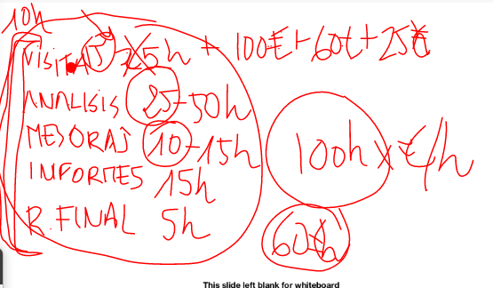
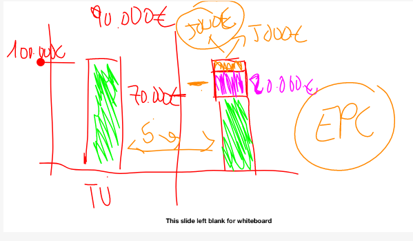
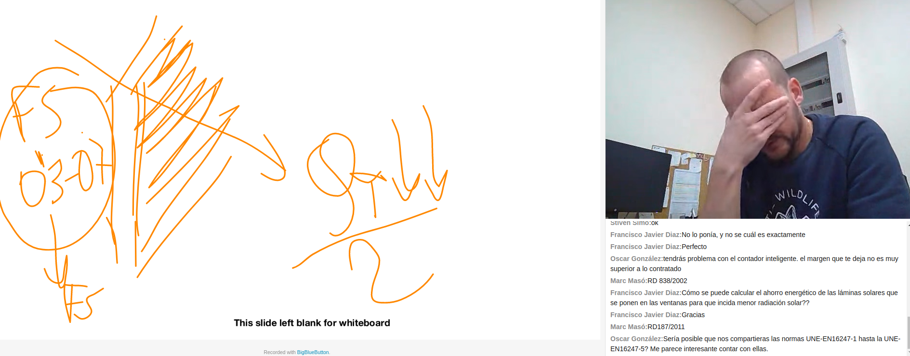

# para calcular el coste por ejmplo para una de 2 dias
se divide en partes

## visita
* con mediadas

a las 25 h hay que sumar 10 h mas de otra visita, viaje etc
serian otro 400 e, pone otra vez el analizador de redes

* sin medidas

se suman las horas precio hora, automnomo 40 e/h
100 h  a 30 eh = 4000 Euros

- horas de ida y vuelta 
- 2 dias en campo = 25 h
- 100 e de hotel
- desplazamiento 200 km 60 + dietas

## analisis
3 dias en edificio qhico
5 dias en grande
de 25 a 50 h

## mejoras
mejoras unos dos dias
10 - 15 h

## informes
2 dias del informe
sihay que ir a presentarla en la reunion final viaje mas 2 horas de presentacion 5h

si la visia es solo de 1 dia, pasariamos solo 60 horas

# estudio ejemplo de tarifa 6.x

es mas facil que la 3.x porque no tien el condiciona, es solo la raiz diferncia por un coeficientede potencias
pero mientaras que n al 3 tienes suviciente con la facutrea, en la 6 hau que pedir la 
curva de carga a la comercializadora y te la tienn que dar, del ultimo ano y aplicar la formula de los apuntes, para cada cuarto de hora

# ESES

factura antes de la mejora 100000

la ese propone proyecto que tendra un ahorro, la factura pasa a
70000
despues de la mjra 30%

no teienes el dinero, coste coherente, 90.000 euros
la ese pone el dinero por adelantado y devuelves cada ano
20.000 para devolver a la ese, y el resto 10000 se repareten como beneficio a la ese y otros 5 como ahorro
durante 5 anos pagas

en resumen sin hacer inversion te ahorras 5000 e al a;o

hay mucho tipos de contratos diferentes pero este es un tipo EPC energy performance contract

La ese garantiza el ahorro, si no se llega tiene que porner el dinero, se hacen muchas clausulas para cuando no se llega a ese porcentaje de ahorro.

tema para otro curso, en icaen. Facilitadores de PC, asesorar, esta en la asociacionon de ingenieros energeticos americanos aee spain chapter http://www.aeespain.org/aee-spain-charter/

Tasa de descuento, 10 es muy alto, lo da el cliente, 3,4 esta mas bien

